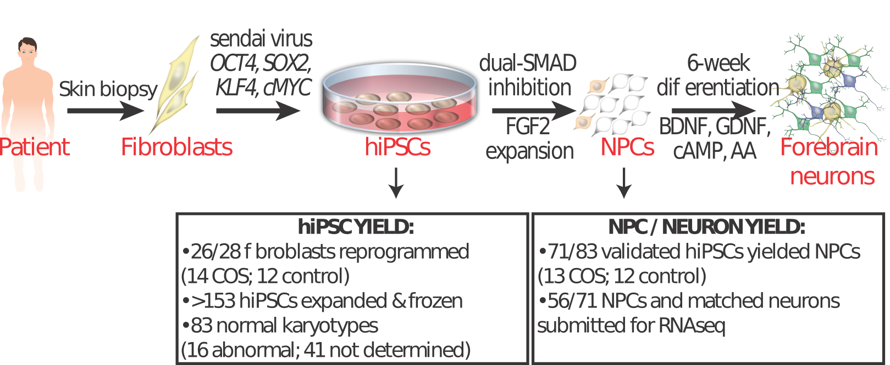

## Public release of code for analysis for COS cohort 

All code is in R and depends on packages from CRAN and Bioconductor.


Code automatically downloads data from Synapse project.

Data is available from [Synapse](https://www.synapse.org/#!Synapse:syn9907463)

Run first analysis in R: 
```
rmarkdown::render("analysis_public_release.Rmd")
```

CNV plots
```
rmarkdown::render("CNV.Rmd")
```


Concordance between this dataset and CommonMind, NIMH HBCC

Note: requires proper to permissions from the [CommonMind project](https://www.synapse.org/#!Synapse:syn2759792): 

You must register with Synapse and have permission to read download this data
```
rmarkdown::render("compare_differential_expression.Rmd")
```
