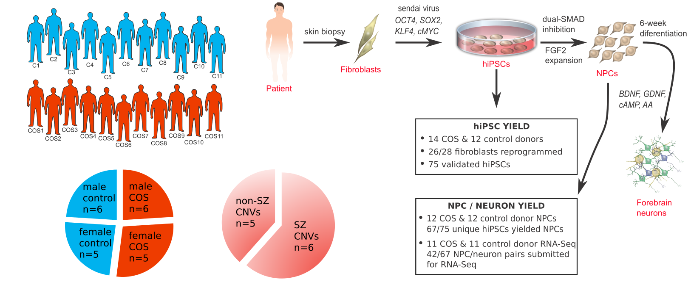
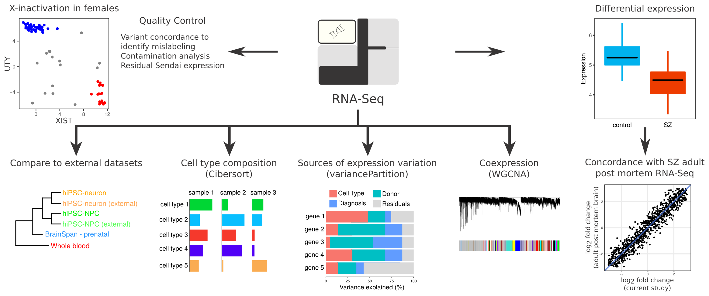

# Experimental workflow


# Computational workflow


## Public release of code for analysis for COS cohort 

All code is in R and depends on packages from CRAN and Bioconductor.


Code automatically downloads data from Synapse project.

Data is available from [Synapse](https://www.synapse.org/hiPSC_COS)

## Install dependencies
First, install ENSEMBL v70 annotations
```
R CMD INSTALL library/EnsDb.Hsapiens.v70_0.0.tar.gz
```
You will need to install additional packages that R requests including the [R SynapseClient](https://github.com/Sage-Bionetworks/rSynapseClient).


## View results pages

[Core analysis](https://rawgit.com/GabrielHoffman/COS_public_release/master/html_results/analysis_public_release.html)

[Differential expression concordance](https://rawgit.com/GabrielHoffman/COS_public_release/master/html_results/compare_differential_expression.html)

[Coexpression](https://rawgit.com/GabrielHoffman/COS_public_release/master/html_results/run_WGCNA.html)

[CNV analysis](https://rawgit.com/GabrielHoffman/COS_public_release/master/html_results/CNV.html)


## Run Analysis
Run first analysis in R: 
```
rmarkdown::render("analysis_public_release.Rmd")
```

CNV plots:
```
rmarkdown::render("CNV.Rmd")
```

Concordance between this dataset and CommonMind, NIMH HBCC

Note: requires proper to permissions from the [CommonMind project](https://www.synapse.org/#!Synapse:syn2759792): 

You must register with Synapse and have permission to read download this data
```
rmarkdown::render("compare_differential_expression.Rmd")
```

Coexpression analysis:
```
rmarkdown::render("run_WGCNA.Rmd")
```

eQTL enrichment analysis:
```
# Generate files with run_eQTL_enrichments.R 
# Run analysis with enrichment_analysis.R based on bash code at the end of run_eQTL_enrichments.R
```
